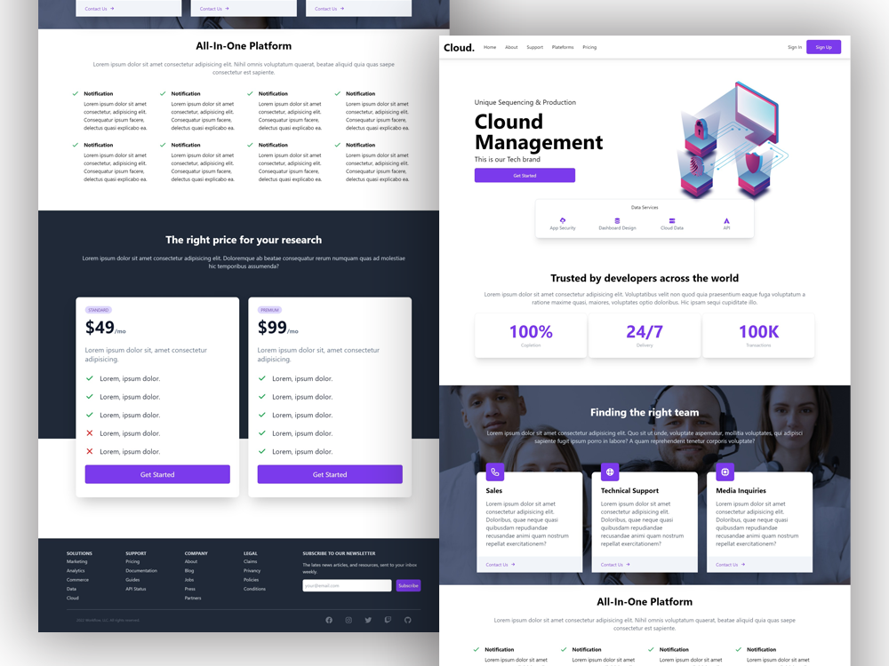
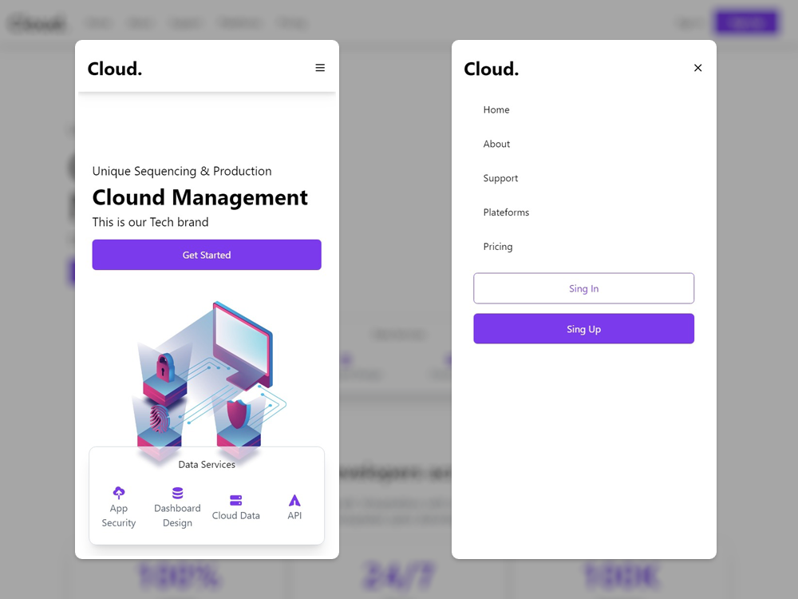

# React-Website-Could

Responsive react website with Tailwind CSS

## Stack
- [React.js](https://reactjs.org/) - A JavaScript library for building user interfaces.
- [Tailwind CSS](https://tailwindcss.com/) - A utility-first CSS framework for rapidly building custom user interfaces.
- [HeroIcons](https://heroicons.com/) - SVG icons,
by the makers of Tailwind CSS.

## Features
- `Responsive` - Mobile first design and responsive for any devices.
- `Scroll-Smooth` - Using react-scroll to make scroll smooth animation for navbar. 

## Desgin

